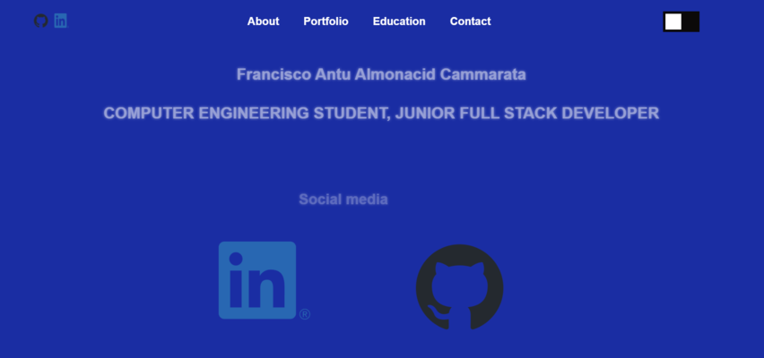
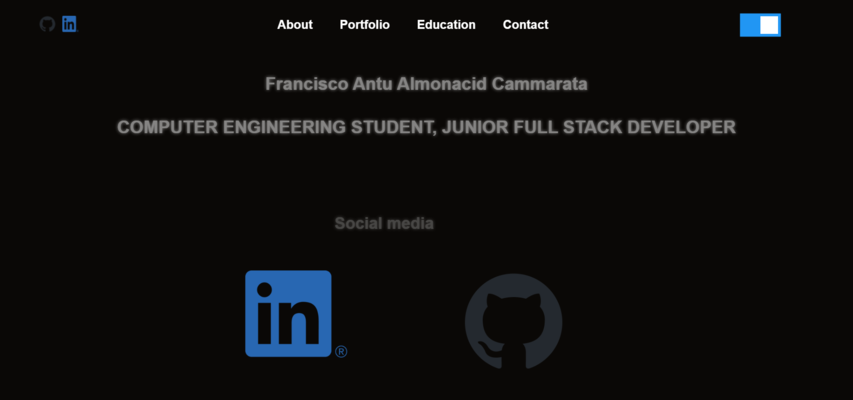

# Personal Portfolio Website

This is a Light and Dark Theme Personal Portfolio Website built using the Flask framework in Python. The website showcases your skills, experiences, education, and provides a way for visitors to contact you.

## Technologies Used

### Frontend
- HTML
- CSS
- JavaScript
- jQuery
- Slick Carousel
- Font Awesome icons

### Backend
- Python
- Flask

## Installation

1. Clone the repository:

   ```bash
   git clone --depth=1 https://github.com/antu2809/portfolio
   cd your-portfolio


2. Install the required packages:

   python -m pip install -r requirements.txt
   (Ubuntu users might need to use python3 instead of python.)

3. Run the Flask application:

  python portfolio.py

4. Access the website at http://localhost:5000 in your web browser.

## Usage

Visit the home page to see information about the developer, including name, status, fields, technologies, and interests.
Explore the "Portfolio" section to view detailed descriptions of various projects, along with associated skills and multimedia.
The "Education" section provides details about the developer's educational background.
You can get in touch with the developer by visiting the "Contact" section and filling out the contact form.


## Screenshots

## Light Theme Homepage



## Dark  Theme Homepage



## Contributing
Contributions are welcome! If you'd like to improve the website, fix issues, or add new features, feel free to submit a pull request.